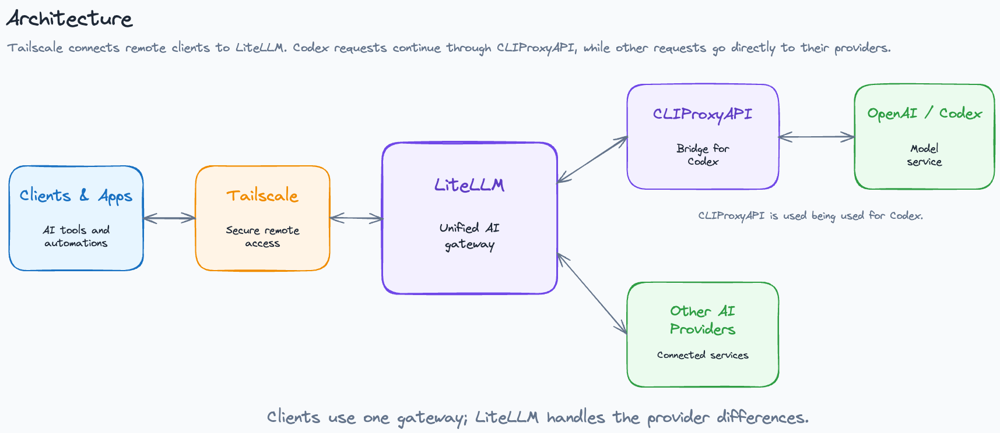

## LiteLLM Setup

Using this LiteLLM setup as a unified LLM gateway for the vibecode harness (e.g. Claude Code and Cursor).

### Unified LLM Gateway Architecture

## Helper Extensions

Cursor extensions that I use for convenience.

See [helper-extensions/README.md](./helper-extensions/README.md).

## IDE Setup

Shared keybindings that map shortcuts to ChatGPT, Claude, Gemini, OpenChamber, and the helper extensions and Ubuntu Cursor install.

See [ide-setup/README.md](./ide-setup/README.md).

